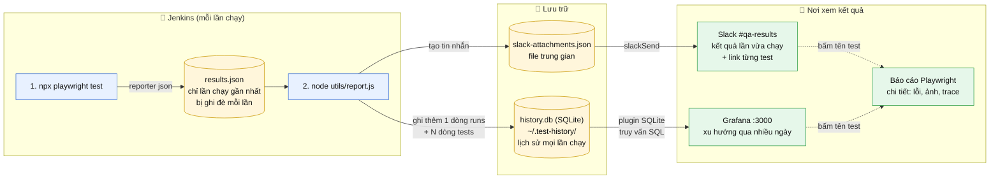

# Grafana: lịch sử và xu hướng kết quả test

Tài liệu này mô tả cách kết quả Playwright được đưa vào Grafana, cách cài và kiểm tra trên máy local, và cách chuyển sang môi trường dùng chung (production).

## 1. Grafana dùng để làm gì

| Công cụ | Trả lời câu hỏi | Ở đâu |
|---|---|---|
| Báo cáo Playwright | Lần chạy này test nào lỗi, vì sao (lỗi, ảnh, trace, các bước) | Link trong tin nhắn Slack |
| Slack | Lần chạy vừa xong kết quả ra sao | Kênh `#qa-results` |
| **Grafana** | Kết quả thay đổi thế nào qua nhiều ngày: tỉ lệ pass, test hay lỗi, test chậm dần | `http://localhost:3000` |

Grafana **không lưu dữ liệu và không chạy test**. Nó chỉ đọc từ một nơi lưu dữ liệu (ở đây là file SQLite) rồi vẽ biểu đồ.
Grafana không hiển thị ảnh chụp, video hay trace của từng test. Phần đó dùng báo cáo Playwright.

## 2. Luồng dữ liệu

### 2.1 Sơ đồ tổng quan



> Mermaid hiển thị trên GitHub và trong bản xem trước Markdown của VS Code. Nếu bạn xem ở nơi không hỗ trợ, dùng bản chữ ở mục 2.3.

### 2.2 Từng bước chạy

| # | Ai làm | Việc gì | Đầu ra | Nằm ở đâu |
|---|---|---|---|---|
| 1 | Playwright | Chạy toàn bộ test | `results.json`, `results.xml`, `playwright-report/` | Thư mục làm việc của job Jenkins |
| 2 | Jenkins (`publishHTML`) | Đăng báo cáo HTML thành tab `PlaywrightReport` | Trang báo cáo, mở qua link | Trang build trong Jenkins |
| 3 | Jenkins (`junit`) | Đọc `results.xml` cho trang **Tests** | Trang kết quả test của Jenkins | Trang build trong Jenkins |
| 4 | `report.js` (phần ghi lịch sử) | Thêm kết quả lần chạy vào SQLite | 1 dòng `runs` + N dòng `tests` | `~/.test-history/history.db` |
| 5 | `report.js` (phần Slack) | Tạo nội dung tin nhắn | `slack-attachments.json` | Thư mục làm việc của job Jenkins |
| 6 | Jenkins (`slackSend`) | Gửi tin nhắn | Tin nhắn với ô từng test | Kênh `#qa-results` |
| 7 | Grafana | Mỗi lần mở dashboard, chạy câu SQL trên `history.db` | Biểu đồ, bảng | `http://localhost:3000` |

Các bước 4 và 5 nằm trong cùng một lệnh `node utils/report.js`. Nếu bước 4 lỗi thì bước 5 vẫn chạy, và cả hai không làm hỏng build.

### 2.3 Bản chữ (dùng khi không xem được sơ đồ)

```
┌───────────────────────── Jenkins (mỗi lần chạy) ─────────────────────────┐
│                                                                          │
│  [1] npx playwright test                                                 │
│        │                                                                 │
│        ▼                                                                 │
│  results.json  ← chỉ có lần chạy gần nhất, bị ghi đè mỗi lần             │
│        │                                                                 │
│        ▼                                                                 │
│  [2] node utils/report.js                                                │
│        │                                                                 │
└────────┼─────────────────────────────────────────────────────────────────┘
         │
         ├──── ghi thêm 1 dòng `runs` + N dòng `tests` ────►  history.db
         │                                                    (SQLite, giữ mọi lần chạy)
         │                                                        │
         │                                                        ▼
         │                                                     Grafana :3000
         │                                                     (xu hướng nhiều ngày)
         │
         └──── tạo slack-attachments.json ──► slackSend ──►  Slack #qa-results
                                                              (lần vừa chạy)

Trong Slack và Grafana, bấm tên một test ──► báo cáo Playwright (chi tiết test đó)
```

### 2.4 Vì sao cần `history.db`

`results.json` chỉ có **một lần chạy** và bị ghi đè ở lần sau, nên tự nó không vẽ được xu hướng. `history.db` giữ lại mỗi lần một dòng, nhờ đó Grafana có dữ liệu qua nhiều ngày.

| | `results.json` | `history.db` |
|---|---|---|
| Chứa | Kết quả lần chạy gần nhất | Kết quả mọi lần chạy |
| Khi có lần chạy mới | Bị ghi đè | Thêm dòng mới |
| Dùng cho | Slack (lần vừa chạy) | Grafana (xu hướng) |

## 3. Các file liên quan

| File | Vai trò |
|---|---|
| [utils/report.js](../../utils/report.js) | Đọc `results.json`, ghi vào SQLite và tạo tin nhắn Slack. Lỗi ở đây không làm hỏng build. |
| [Jenkinsfile](../../Jenkinsfile) | Gọi `node utils/report.js` trong khối `post { always { ... } }`. |
| [playwright.config.ts](../../playwright.config.ts) | Reporter `json` tạo `results.json` (và `junit` tạo `results.xml`). |
| [grafana/dashboard.json](../../grafana/dashboard.json) | Dashboard "Playwright test history" (bố cục và các câu SQL). |
| `~/.test-history/history.db` | Dữ liệu thật. Nằm ngoài dự án, git không theo dõi. |
| `~/.test-history/demo.db` | Dữ liệu giả 30 ngày, chỉ để xem thử dashboard. |
| `/opt/homebrew/etc/grafana/provisioning/datasources/test-history.yaml` | Khai báo nguồn dữ liệu SQLite cho Grafana. |
| `/opt/homebrew/etc/grafana/provisioning/dashboards/test-history.yaml` | Cho Grafana nạp dashboard từ thư mục `grafana/` của dự án. |
| `/opt/homebrew/etc/grafana/grafana.ini` | Dòng `provisioning = /opt/homebrew/etc/grafana/provisioning`. Bản sao lưu: `grafana.ini.bak-before-testhistory`. |

## 4. Cấu trúc dữ liệu (SQLite)

**`runs`**: mỗi build một dòng

| Cột | Ý nghĩa |
|---|---|
| job, build | Tên job và số build Jenkins (khoá chính) |
| started | Giờ bắt đầu (UTC, ISO) |
| passed, failed, flaky, skipped | Số test theo trạng thái |
| duration_ms | Tổng thời gian chạy |
| build_url | Link build trong Jenkins |

**`tests`**: mỗi test của mỗi build một dòng

| Cột | Ý nghĩa |
|---|---|
| job, build, test_id, project | Khoá chính |
| title, file, line | Tên và vị trí test |
| status | `expected` (pass), `unexpected` (lỗi), `flaky`, `skipped` |
| duration_ms, started, attempts | Thời gian, giờ chạy, số lần thử |
| error | Vài dòng đầu của lỗi |
| url | Link chi tiết test trong báo cáo Playwright |

Chạy lại cùng một build sẽ thay thế dòng cũ, không tạo dòng trùng.

## 5. Cài đặt trên máy local

Đã thực hiện trên máy này. Ghi lại để làm lại trên máy khác.

1. Cài Grafana và plugin SQLite:
   ```bash
   brew install grafana
   grafana cli --homepath /opt/homebrew/opt/grafana/share/grafana \
     --pluginsDir /opt/homebrew/var/lib/grafana/plugins \
     plugins install frser-sqlite-datasource
   ```
   Nếu báo `connection reset`, chạy lại lệnh (lỗi mạng tạm thời).
2. Tạo hai file khai báo (thư mục `/opt/homebrew/etc/grafana/provisioning/`):
   - `datasources/test-history.yaml`: nguồn dữ liệu `uid: test-history`, `type: frser-sqlite-datasource`, `jsonData.path` là đường dẫn file `.db`.
   - `dashboards/test-history.yaml`: provider `type: file`, `options.path` là thư mục `grafana/` của dự án.
3. Trong `/opt/homebrew/etc/grafana/grafana.ini`, mục `[paths]`, đặt:
   ```ini
   provisioning = /opt/homebrew/etc/grafana/provisioning
   ```
4. Khởi động: `brew services start grafana` (hoặc `restart` sau khi sửa cấu hình).
5. Mở `http://localhost:3000`, đăng nhập `admin`/`admin` lần đầu và **đổi mật khẩu ngay**.

## 6. Chuyển từ dữ liệu giả sang dữ liệu thật

Chỉ làm sau khi Jenkins đã chạy ít nhất một build bằng Jenkinsfile mới.

1. Commit và push `utils/report.js`, `Jenkinsfile` và `grafana/dashboard.json`.
2. Chạy **Build Now** trong Jenkins.
3. Kiểm tra `history.db` đã có dữ liệu (mục 7).
4. Sửa `path` trong `datasources/test-history.yaml` từ `demo.db` thành `/Users/thuong/.test-history/history.db`.
5. Chạy `brew services restart grafana`, mở lại dashboard.

Đổi trước bước 3 sẽ làm Grafana trỏ vào file chưa tồn tại và dashboard báo lỗi.

Với lịch chạy mỗi ngày một lần, dashboard có 1 điểm dữ liệu mỗi ngày. Các ô số, biểu đồ tròn và bảng có dữ liệu ngay sau build đầu, còn các biểu đồ xu hướng cần vài ngày đến vài tuần.

## 7. Cách kiểm tra

**Grafana đang chạy:**
```bash
curl -s http://localhost:3000/api/health          # phải có "database": "ok"
brew services list | grep grafana                 # phải là started
```

**Plugin SQLite đã cài:**
```bash
ls /opt/homebrew/var/lib/grafana/plugins          # có frser-sqlite-datasource
```

**Dữ liệu đã được ghi (sau một build):**
```bash
ls -la ~/.test-history/
sqlite3 -header -column ~/.test-history/history.db \
  "select build, started, passed, failed, flaky, duration_ms from runs order by build desc limit 5;"
sqlite3 -header -column ~/.test-history/history.db \
  "select title, status, duration_ms from tests where build=(select max(build) from runs) order by duration_ms desc limit 10;"
```
Có thể mở `history.db` bằng DB Browser for SQLite (`brew install --cask db-browser-for-sqlite`).

**Dashboard:** mở `http://localhost:3000` → **Dashboards** → **Playwright test history**.

**Log khi có lỗi:**
```bash
grep -iE "error|provisioning" /opt/homebrew/var/log/grafana/grafana.log | tail -20
```
Trong log Jenkins (Console Output), tìm dòng `Saved N tests for ... to ...` hoặc `History not saved: ...`.

## 8. Chuyển sang môi trường dùng chung (production)

Cấu hình hiện tại chạy trên một máy cá nhân. Để cả nhóm dùng lâu dài, cần cân nhắc:

**Truy cập cho đồng nghiệp**
- Cả nhóm cùng vào được một địa chỉ. Với làm việc hybrid, dùng **Tailscale** (mạng riêng ảo), hoặc đặt Jenkins và Grafana trên một máy chủ luôn bật.
- Grafana mặc định nghe `localhost`. Muốn truy cập từ xa, đặt `http_addr` trong `grafana.ini` và mở cổng 3000.
- Đặt **Jenkins URL** (Manage Jenkins → System) thành địa chỉ đó để link trong Slack không còn là `localhost`.

**Máy chạy phải luôn bật**
- Nếu Jenkins và Grafana chạy trên laptop, khi máy ngủ hoặc tắt thì lịch chạy hằng ngày, Grafana và dữ liệu đều ngừng. Nên chuyển lên một máy luôn bật.

**Bảo mật**
- Đổi mật khẩu `admin`. Đừng để Grafana và Jenkins truy cập công khai từ internet.
- Jenkins đang nới CSP (`hudson.model.DirectoryBrowserSupport.CSP=`) để báo cáo Playwright chạy được JavaScript. Điều này chấp nhận được trong nhóm nhỏ tin cậy. Nếu Jenkins dùng chung nhiều team, cân nhắc HTML Publisher hoặc đặt báo cáo ở nơi khác.

**Dữ liệu**
- SQLite là một file và phù hợp với một Jenkins. Nếu nhiều agent Jenkins cùng ghi, hoặc cần Grafana ở máy khác với Jenkins, dùng PostgreSQL hoặc InfluxDB. Khi đó `report.js` cần đổi phần ghi dữ liệu, còn dashboard cần đổi loại nguồn dữ liệu.
- Sao lưu `~/.test-history/history.db`. Mất file này là mất toàn bộ lịch sử.
- Đường dẫn trong file cấu hình (`/Users/thuong/...`) là của máy hiện tại và cần đổi khi dùng máy khác.

## 9. Gỡ bỏ

```bash
brew services stop grafana
rm /opt/homebrew/etc/grafana/provisioning/datasources/test-history.yaml
rm /opt/homebrew/etc/grafana/provisioning/dashboards/test-history.yaml
cp /opt/homebrew/etc/grafana/grafana.ini.bak-before-testhistory /opt/homebrew/etc/grafana/grafana.ini
rm -rf ~/.test-history            # xoá cả dữ liệu lịch sử
```
Muốn giữ Slack nhưng bỏ Grafana, xoá phần `saveHistory` trong `utils/report.js`.

## 10. Chưa được kiểm chứng

- `report.js` đã chạy đúng với dữ liệu mẫu trên máy local, nhưng chưa chạy trong một build Jenkins thật.
- Dashboard đã được nạp không lỗi (theo log Grafana), và toàn bộ câu SQL chạy đúng trên dữ liệu mẫu. Bố cục hiển thị trên giao diện chưa được kiểm tra bằng mắt.
- Các bước ở mục 8 là hướng dẫn chung, chưa được thử.
